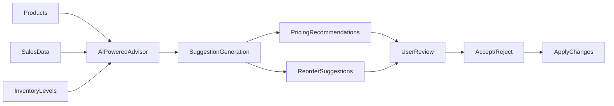

<div align="center">
  
  
  
  
</div>

<h1 align="center">🛍️ ShopStream</h1>

<p align="center">
  <strong>AI-Powered Inventory & Pricing Management System</strong>
</p>

<p align="center">
  
  
  
</p>

---

## 🌟 What is ShopStream?

ShopStream is an intelligent commerce platform that helps retailers optimize their inventory and pricing strategies using artificial intelligence. Unlike traditional inventory management systems, ShopStream doesn't just track stock—it actively suggests smart actions to maximize profits and minimize waste.

### 🔮 AI-Powered Intelligence
- **Smart Pricing**: Automatically suggests optimal prices based on demand patterns
- **Inventory Forecasting**: Predicts when to reorder stock before running out
- **Trend Analysis**: Identifies sales patterns and seasonal fluctuations
- **Competitive Edge**: Makes data-driven decisions faster than manual analysis

### 🎯 Key Features

| Feature | Description |
|--------|-------------|
| **🎯 Real-time Inventory Tracking** | Monitor stock levels across all products instantly |
| **🤖 AI Advisor** | Get intelligent suggestions for pricing and reordering |
| **📈 Demand Analytics** | Understand which products are trending up or down |
| **📊 Interactive Dashboard** | Visualize key metrics at a glance |
| **⚡ One-click Actions** | Implement AI suggestions with a single click |
| **📚 Full History** | Track all price changes and decisions |

---


## 🛠️ Detailed Installation

### Prerequisites
Before you begin, make sure you have these installed:
- **Node.js** (version 18 or higher) [[Download here](https://nodejs.org/)]
- **npm** (comes with Node.js)
- **Git** [[Download here](https://git-scm.com/)]
- **Docker** (optional but recommended) [[Download here](https://www.docker.com/products/docker-desktop)]

### Step-by-Step Setup

#### 1. Clone the Repository
```bash
git clone https://github.com/yourusername/shopstream.git
cd shopstream
```

#### 2. Choose Your Startup Method

**Option A: Automated Startup (Recommended)**
```bash
# For Windows
start-system.bat

# For Mac/Linux
chmod +x start-system.sh
./start-system.sh

# Cross-platform

## 🧠 How ShopStream Works

### The Intelligent Flow



### Core Components

1. **🛒 Product Management**
   - Add, edit, and organize your product catalog
   - Track stock levels, prices, and categories
   - Monitor demand velocity in real-time

2. **🤖 AI Advisory Engine**
   - Monitors inventory signals 24/7
   - Generates contextual suggestions
   - Provides confidence scores for decisions

3. **💡 Smart Suggestions**
   - **Pricing**: Increase/decrease prices based on demand
   - **Reordering**: Suggest optimal order quantities
   - **Risk Management**: Protect against stockouts and overstocks

4. **📊 Analytics Dashboard**
   - Visualize key performance indicators
   - Identify trending and declining products
   - Track inventory value and turnover

---

## 🎮 Using ShopStream

### First-Time Experience

1. **Dashboard Overview**
   - See your overall inventory health
   - Identify low-stock warnings
   - Review pending AI suggestions

2. **Adding Products**
   ```
   Product Details:
   - SKU: Unique identifier (e.g., "SHIRT-BLK-L")
   - Name: Human-readable name
   - Category: Product grouping
   - Price: Current selling price
   - Cost Price: Purchase cost (for margin calculation)
   - Stock: Current inventory count
   - Reorder Threshold: When to get alerted
   ```

3. **Working with AI Suggestions**
   - **Pending Tab**: Review all AI recommendations
   - **Details**: Read the AI's reasoning
   - **Accept**: Implement the suggestion immediately
   - **Reject**: Decline without changes
   - **Manual Trigger**: Ask AI for fresh advice anytime

### Advanced Features

#### Simulating Sales
Test how the system responds to different scenarios:

## 🏗️ Technical Architecture

### System Overview
```
┌─────────────────┐    ┌──────────────────┐    ┌──────────────────┐
│   Frontend      │    │   Backend API    │    │   PostgreSQL     │
│   React/Vite    │◄──►│   Node/Express   │◄──►│   Database       │
└─────────────────┘    └──────────────────┘    └──────────────────┘
         ▲                      ▲                      
         │                ┌─────┴─────┐                
         │                │  AI Layer │                
         │                │ (Gemini/  │                
         │                │ LiteLLM)  │                
         │                └───────────┘                
         │                                              
┌─────────────────┐                                    
│   User Browser  │                                    
└─────────────────┘                                    
```

### Technology Stack

**Frontend**
- React 18+ with Hooks
- Vite for blazing-fast development
- Modern CSS with responsive design
- Axios for API communication

**Backend**
- Node.js with Express framework
- PostgreSQL with Prisma ORM
- RESTful API architecture
- Swagger/OpenAPI documentation
- Zod validation for data integrity

**AI Intelligence**
- Primary: Google Gemini API
- Secondary: LiteLLM integration
- Fallback: Rule-based algorithm
- Contextual prompting system

### Database Schema

**Products Table**
```
id (UUID)           - Unique identifier
sku (String)        - Stock Keeping Unit
name (String)       - Product name
category (String)   - Product category
price (Float)       - Selling price
costPrice (Float?)  - Purchase cost (optional)
stock (Integer)     - Current inventory
demandVelocity (Float) - Sales rate per day
status (Enum)       - ACTIVE/DISCONTINUED/OUT_OF_STOCK

## 🤝 Contributing

We love contributions! Here's how you can help:

1. Fork the repository
2. Create your feature branch (`git checkout -b feature/AmazingFeature`)
3. Commit your changes (`git commit -m 'Add some AmazingFeature'`)
4. Push to the branch (`git push origin feature/AmazingFeature`)
5. Open a Pull Request

### Development Setup
```bash
# Install root dependencies
npm install

# Backend development
cd backend
npm run dev

# Frontend development
cd frontend
npm run dev

# Database utilities
npm run db:migrate  # Run migrations
npm run db:seed     # Seed sample data
npm run db:studio   # Open Prisma Studio
```

---

## 📄 License

This project is licensed under the MIT License - see the [LICENSE](LICENSE) file for details.

---

## 🙋‍♀️ Support

Having trouble? We're here to help!

- **Documentation**: Check our [Wiki](../../wiki)
- **Issues**: [Open an issue](../../issues/new)
- **Questions**: Email support@shopstream.com
- **Community**: Join our [Discord](https://discord.gg/shopstream)

---

<p align="center">
  Made with ❤️ for smarter retail management
</p>
```

**Suggestions Table**
```
id (UUID)           - Unique identifier
productId (FK)      - Related product
type (Enum)         - PRICING/REORDER
status (Enum)       - PENDING/ACCEPTED/REJECTED
recommendations (JSON) - AI-generated suggestions
confidence (Float)  - Confidence score (0.0-1.0)
```

---

## 📚 API Documentation

Complete API documentation is available at: http://localhost:4000/api/docs

### Key Endpoints

#### Product Management
- `GET /api/products` - List all products
- `POST /api/products` - Create new product
- `GET /api/products/:id` - Get product details
- `PATCH /api/products/:id` - Update product
- `PATCH /api/products/:id/stock` - Update stock level

#### AI Interaction
- `POST /api/products/:id/advise` - Trigger AI advisory
- `POST /api/products/:id/suggest-pricing` - Get pricing suggestion
- `POST /api/products/:id/suggest-reorder` - Get reorder suggestion

#### Suggestions System
- `GET /api/suggestions` - List all suggestions
- `POST /api/suggestions/:id/accept` - Accept suggestion
- `POST /api/suggestions/:id/reject` - Reject suggestion
- Click "Simulate Sale" on any product
- Watch demand velocity increase
- See AI suggestions appear for trending products

#### Demand Spike Detection
When products sell faster than usual:
- System automatically triggers AI analysis
- Gets suggestions to raise prices or increase orders
- Helps capitalize on popularity

#### Low Stock Protection
When inventory runs low:
- Immediate alert generation
- Suggestion to increase prices temporarily
- Recommendation for large reorder quantities
npm start
```

**Option B: Manual Setup**
```bash
# Terminal 1: Start Backend
cd backend
npm install
npm run dev

# Terminal 2: Start Frontend
cd frontend
npm install
npm run dev
```

#### 3. Access the Application
Once everything is running, open your browser and navigate to:
- **Application**: http://localhost:5173
- **API Documentation**: http://localhost:4000/api/docs
- **Backend API**: http://localhost:4000
## 🚀 Quick Start

Ready to dive in? Get ShopStream running in minutes!

### One-Command Startup (Recommended)
```bash
# Clone the repository
git clone https://github.com/yourusername/shopstream.git
cd shopstream

# Start everything with one command!
npm start
```

That's it! The system will automatically:
1. Set up the database (using Docker)
2. Install all dependencies
3. Start both frontend and backend
4. Open your browser to http://localhost:5173